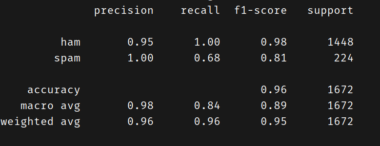

# SMS_SPAM_DETECTION
This is a NLP project, that can detect  SMS as Spam/Ham. It takes the data from the .txt file and the using **Naive Bayes** algorithm predicts the Output, achieving **Accuracy of : 96%**

